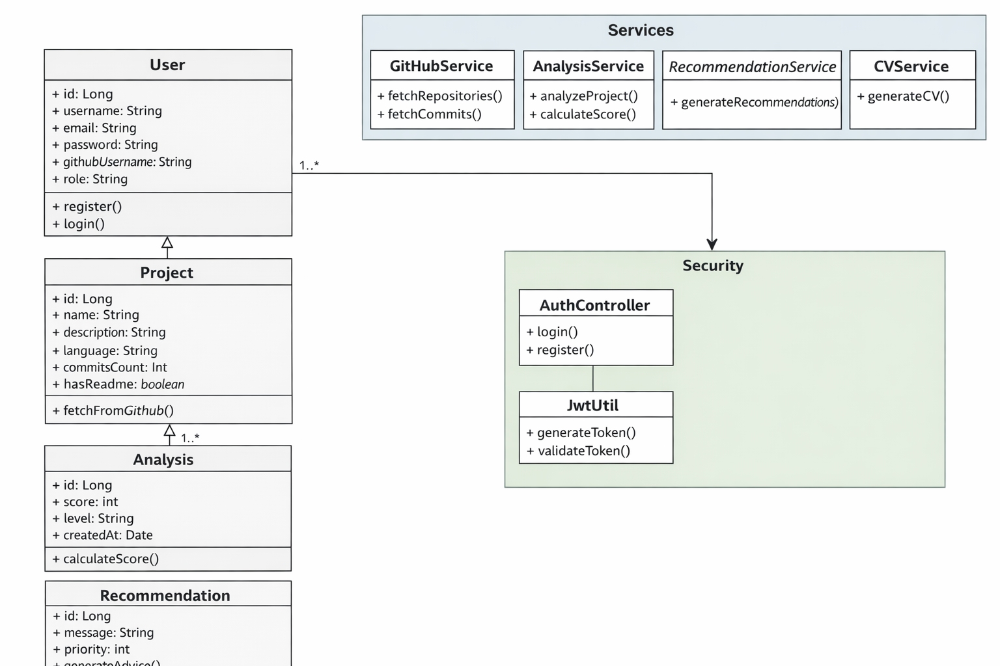

Parfait 👌 je vais te faire un **document complet, propre, structuré comme un vrai dossier de projet (niveau ESN / école / portfolio)** que tu peux copier dans Word / PDF / Notion directement.

---

# 📘 DOCUMENT COMPLET DU PROJET

## 🚀 **DevInsight – Plateforme intelligente d’analyse de projets GitHub**

---

# 🧾 1. INTRODUCTION

## 📌 Contexte

Dans le domaine du développement informatique, les plateformes comme GitHub sont largement utilisées pour partager du code. Cependant :

* Les recruteurs n’ont pas le temps d’analyser chaque projet en détail
* Les développeurs ne savent pas évaluer leur niveau réel
* Les profils LinkedIn sont souvent mal optimisés

👉 Il existe donc un besoin d’un système permettant d’**analyser automatiquement les projets et valoriser les compétences**.

---

## 🎯 Objectif

Développer une application web permettant de :

* analyser automatiquement les repositories GitHub
* attribuer un score technique
* proposer des recommandations intelligentes
* générer un CV et un profil LinkedIn optimisé

---

## 👥 Cible

* Étudiants en informatique
* Développeurs juniors
* Freelancers

---

---

# ⚙️ 2. DESCRIPTION FONCTIONNELLE

---

## 🔐 2.1 Authentification

* Inscription utilisateur
* Connexion sécurisée avec JWT
* Gestion des rôles (USER / ADMIN)

---

## 🔗 2.2 Intégration GitHub

* Saisie du username GitHub
* Récupération automatique des projets
* Synchronisation des données

---

## 📊 2.3 Analyse des projets (MODULE PRINCIPAL)

### 🔍 Données analysées :

* Nombre de commits
* Langages utilisés
* Présence README
* Tests unitaires
* Activité du projet

---

### 📈 Score technique

Score = 0.3 \times Commits + 20 \times README + 5 \times Langages + 30 \times Tests

---

### 🎯 Résultat :

* Score global (/100)
* Score par projet
* Niveau :

  * Débutant
  * Intermédiaire
  * Avancé

---

## 🧠 2.4 Recommandations intelligentes

Exemples :

* Ajouter des tests unitaires
* Améliorer le README
* Refactoriser le code
* Structurer le projet

---

## 📄 2.5 Génération de CV

* Génération automatique du contenu
* Mise en forme professionnelle
* Export PDF

---

## 💼 2.6 Optimisation LinkedIn

* Génération de résumé professionnel
* Suggestions de compétences
* Texte prêt à copier

---

## 📊 2.7 Dashboard

* Score global
* Graphiques
* Historique des analyses
* Statistiques

---

---

# 🏗️ 3. ARCHITECTURE TECHNIQUE

---

## 🔙 Backend (Spring Boot)

### 📦 Structure

```plaintext
com.devinsight
├── controller
├── service
├── repository
├── model
├── dto
├── security
├── config
```

---

### 🧩 Services principaux

* AuthService
* GitHubService
* AnalysisService
* RecommendationService
* CVService

---

## 🗄️ Base de données (PostgreSQL)

### Tables :

### users

* id
* username
* email
* password
* github_username

---

### projects

* id
* name
* language
* commits_count
* has_readme

---

### analysis

* id
* score
* level
* created_at

---

### recommendations

* id
* message
* priority

---

---

## 🎨 Frontend (React)

### 📁 Structure

```plaintext
src/
├── components/
├── pages/
├── services/
├── hooks/
├── context/
```

---

### 📄 Pages principales

* Login / Register
* Dashboard
* Analyse projet
* Profil
* CV Generator

---

---

# 🔐 4. SÉCURITÉ

* Authentification JWT
* Protection des routes
* Gestion des rôles
* Validation des données

---

---

# 🧪 5. EXIGENCES NON FONCTIONNELLES

---

## ⚡ Performance

* Temps de réponse < 2 secondes

---

## 🔒 Sécurité

* Protection des données utilisateur
* API sécurisée

---

## 📱 UX/UI

* Responsive design
* Interface moderne
* Navigation fluide

---

## 🔄 Maintenabilité

* Code structuré
* Architecture claire
* Documentation

---

---

# 📅 6. PLANIFICATION

---

## 🗓️ Semaine 1

* Authentification
* Structure backend
* Connexion GitHub

---

## 🗓️ Semaine 2

* Analyse des projets
* Dashboard
* Recommandations

---

## 🗓️ Semaine 3

* Génération CV
* Optimisation LinkedIn
* UI/UX

---

---

# 📐 7. UML (RÉSUMÉ)

---

## 🧩 Classes principales

* User
* Project
* Analysis
* Recommendation

---

## 🔄 Flux principal

1. L’utilisateur se connecte
2. Il connecte son GitHub
3. Les projets sont récupérés
4. Une analyse est effectuée
5. Un score est généré
6. Des recommandations sont proposées

---

---

# 💼 8. VALEUR AJOUTÉE

---

👉 Ce projet montre :

* maîtrise Fullstack (Spring Boot + React)
* intégration API externe
* logique métier avancée
* architecture propre
* réflexion produit

---

💥 Ce type de projet est **très apprécié en ESN**

---

---

# 📈 9. STRATÉGIE LINKEDIN

---

## 📝 Exemple de post

> 🚀 J’ai développé DevInsight
> Une plateforme qui analyse automatiquement les projets GitHub et génère un score technique + recommandations
>
> ⚙️ Stack: Spring Boot + React
> 📊 Dashboard interactif
> 🤖 Analyse intelligente
>
> 🎯 Objectif: aider les développeurs à améliorer leur profil

---

---

# 🧠 10. ÉVOLUTIONS

* IA avancée
* Matching avec offres d’emploi
* Mode recruteur
* Application mobile

---

---

# 🎯 CONCLUSION

DevInsight est :

* un projet technique
* un produit utile
* un outil valorisable

👉 Il te permet de te démarquer clairement des autres candidats.

---

---

# 🔥 PROCHAINE ÉTAPE

Si tu veux aller encore plus loin, je peux te faire :

* 📊 **le vrai diagramme UML en image (draw.io téléchargeable)**
* 🧩 **le starter Spring Boot complet (prêt à coder)**
* 🎨 **un design UI React moderne (comme une startup)**

Dis-moi ce que tu veux 👍


